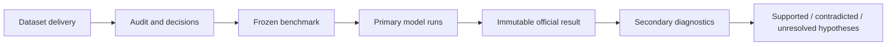

# ArchiveTrust HTR

ArchiveTrust is a Swedish Historical Handwritten Text Recognition (HTR) research project that evolved from an evidence-first OCR/telemetry system into a full training and independent benchmarking workflow.

The project asks a deliberately modest question:

> **How far can a privately trained, scratch HTR model get when compared fairly with an institutional model from the Swedish National Archives?**

The final ArchiveTrust model was trained from scratch with Loghi-HTR on roughly **562,000 Swedish handwritten line images**. It reached **9.98% CER** on its internal in-distribution validation set, then **32.70% CER** on a frozen independent Svea Hovrätt benchmark. Riksarkivet Swedish Lion Libre reached **18.42% CER** on the same benchmark.

The point of the project is not that the hobby model beat Lion. It did not. The point is that the difference was measured under controlled, auditable conditions, with the benchmark frozen before model output, failures retained, post-hoc diagnostics separated from the primary result, and negative findings preserved.

## Read the project story

1. [Executive summary and full English report](docs/PROJECT_REPORT.md)
2. [Svensk projektrapport](docs/PROJECT_REPORT.sv.md)
3. [Evidence and telemetry origins](docs/PROJECT_REPORT.md#4-stage-1-archivetrust-as-an-evidence-and-telemetry-system)
4. [Transition to HTR](docs/PROJECT_REPORT.md#5-stage-2-turning-the-platform-toward-htr)
5. [Loghi training experiments](docs/PROJECT_REPORT.md#6-stage-3-training-a-swedish-loghi-model)
6. [Independent benchmark](docs/PROJECT_REPORT.md#7-stage-4-the-independent-benchmark)
7. [Post-benchmark gap investigation](docs/PROJECT_REPORT.md#8-stage-5-investigating-the-performance-gap)
8. [Conclusions, limitations and reproducibility](docs/PROJECT_REPORT.md#9-what-the-project-established)

## Executive summary

### Final model

- **Model:** `loghi-swedish-scratch-exp2-epoch7`
- **Training:** from scratch, Loghi-HTR
- **Training corpus:** ~562,123 Swedish handwritten text-line images from 11 archival collections
- **Internal validation:** CER **0.0998**, WER **0.3273**
- **Decoder:** beam width 10
- **Checkpoint:** frozen and backed up in the GitHub Release `model-loghi-swedish-scratch-exp2-epoch7`

The epoch-7 checkpoint has a documented caveat: it is a verified weights-only continuation from epoch 6 after a long continuous run crashed, so its optimizer/LR continuity differs from epochs 1-6.

### Independent benchmark

The final benchmark, `svea-hovratt-2026-09-primary-v2`, was frozen before model inference and contains:

- **4 documents**
- **105 pages**
- **4,627 lines**
- **166,201 reference characters**
- **28,872 reference words**

The first freeze contained probable uncorrected recognition output in part of the supplied transcription. A deterministic completeness audit and fixed review procedure removed **35 pages / 1,859 lines** before either model was scored. The original freeze was preserved and marked superseded.

### Official result

| Metric | ArchiveTrust Loghi | Riksarkivet Lion |
|---|---:|---:|
| CER | **32.70%** | **18.42%** |
| WER | **67.53%** | **43.63%** |
| Character deletions | 32,506 | 9,468 |
| Empty outputs | 71 | 0 |
| Exact-line accuracy | 0.89% | 7.33% |

Lion had lower CER on every retained page and every retained document.

Paired page-cluster bootstrap analysis also clearly separated the models:

- CER difference, Lion − Loghi: **[-15.25, -13.30] percentage points**
- WER difference, Lion − Loghi: **[-25.28, -22.60] percentage points**

## What happened after the benchmark?

The project did **not** immediately retrain or tune until the score improved.

Instead, the gap was investigated with secondary diagnostics:

- **Beam width:** beam 1 vs beam 10 changed CER by only **0.30 pp**.
- **Minimum-width padding:** contradicted the main narrow-crop hypothesis and slightly worsened results, including **71 → 138** empty outputs.
- **Batch-composition artifact:** confirmed that some Loghi predictions change depending on batch companions even when the crop itself is unchanged.
- **Per-sample CTC sequence-length fix:** worked correctly in isolated unit tests but did **not** remove the real-crop batch dependence.
- Final diagnostic verdict: **MECHANISM INCOMPLETE**.
- The full benchmark was therefore not rerun with that patch, per the preregistered stopping rule.

The official benchmark result remains immutable.

## The main technical finding

The largest remaining behavior in the scratch Loghi model is **under-production**:

- mean prediction/reference length ratio: **0.80** for Loghi vs **0.98** for Lion;
- **26.2%** of Loghi lines were shorter than 75% of the reference;
- short and narrow lines were particularly difficult;
- Swedish diacritics `å`, `ä`, and `ö` were also weaker relative to Lion.

These observations are real. Their deeper cause has **not** been cleanly decomposed.

Differences in architecture, pretraining, training-data diversity and model capacity remain plausible explanations, but the repository does not present those hypotheses as proven causes.

## Research discipline

ArchiveTrust follows an evidence-first approach:

Key principles:

- freeze data before looking at model accuracy;
- keep raw model output;
- count failed and empty predictions instead of dropping them;
- separate primary results from post-hoc diagnostics;
- hash models, manifests, predictions and evidence artifacts;
- preserve negative experiments;
- define stopping rules before chasing a hypothesis;
- keep heavy/raw datasets out of Git while retaining provenance, decisions, manifests and reproducibility evidence.

## Important repository areas

| Path | Purpose |
|---|---|
| [`docs/PROJECT_REPORT.md`](docs/PROJECT_REPORT.md) | Complete concise project narrative |
| [`docs/PROJECT_REPORT.sv.md`](docs/PROJECT_REPORT.sv.md) | Swedish version |
| [`docs/BENCHMARK_PROTOCOL.md`](docs/BENCHMARK_PROTOCOL.md) | Locked benchmark methodology |
| [`docs/DATASETS.md`](docs/DATASETS.md) | Dataset provenance and benchmark notes |
| [`training/`](training/) | Training experiment history and reports |
| [`benchmark-data/benchmark/`](benchmark-data/benchmark/) | Frozen benchmark metadata |
| [`benchmark-data/reports/`](benchmark-data/reports/) | Official benchmark outputs |
| [`benchmark-data/work/svea-hovratt-2026-09/`](benchmark-data/work/svea-hovratt-2026-09/) | Construction audits and post-benchmark diagnostics |
| [`docs/experiments/`](docs/experiments/) | Earlier HTR method-comparison work |
| [`src/archivetrust/htr/benchmark/`](src/archivetrust/htr/benchmark/) | Independent benchmark harness |

## Historical phases

The current repository contains earlier systems on purpose.

ArchiveTrust originally explored a provider-independent OCR trust layer, then an HTR research environment with SATRN, Florence-2 and Transkribus-oriented workflows. Those stages are **historical project evidence**, not the current final experiment.

They matter because several ideas from that phase survived into the final work:

- raw-vs-normalized output separation;
- provenance and content hashes;
- telemetry;
- explicit failure states;
- controlled comparison;
- segmentation/recognition separation;
- supersede rather than silently overwrite.

For the detailed evolution, see [the full report](docs/PROJECT_REPORT.md).

## Attribution

### Anders Hast

**Anders Hast, He/Him**  
Professor in Computerised Image Processing at Uppsala University  
Distinguished University Teacher, InfraVis Faculty  
[LinkedIn](https://www.linkedin.com/in/anders-hast-15536372/)

Special thanks to Anders Hast for his contribution to the project's research direction and for supplying the dataset used for the final independent benchmark.

## Status

**Training is finished.**  
**The official independent benchmark is complete.**  
**The post-benchmark inference/batching diagnostic branch is closed for the current fix attempt.**

The project currently stops with a measured, reproducible comparison rather than a post-hoc attempt to train until the benchmark looks better.

---

ArchiveTrust started as a question about whether AI output could be trusted.

It ended up becoming a project about how to make sure the answer is supported by evidence.
