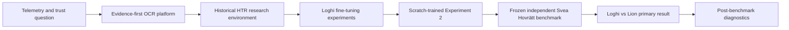
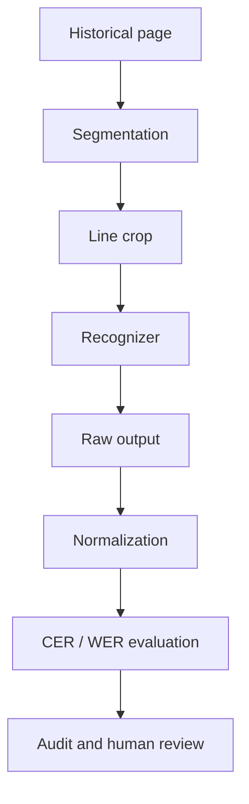
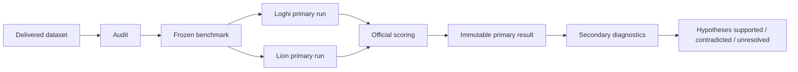

# ArchiveTrust HTR
## From evidence-first OCR trust to an independent Swedish handwriting benchmark

**Project report, September 2026**  
**Author:** Dennis Jensen  
**Repository:** `hypergeek-dev/ArchiveTrust_HCR`

ArchiveTrust became a personal research project about a deceptively simple question:

> How far can a privately trained, hobby-level historical handwriting recognition model get when compared fairly with an institutional model from the Swedish National Archives?

It did not begin there. The project started as an attempt to make OCR and AI output more observable, traceable, and trustworthy. That concern shaped everything that followed: raw outputs were preserved, experiments were versioned, failures were counted instead of discarded, datasets were audited before scoring, and later diagnostic experiments were kept separate from the official benchmark.

## Contents

1. [Executive summary](#1-executive-summary)
2. [Svensk sammanfattning](PROJECT_REPORT.sv.md)
3. [Where the idea came from](#3-where-the-idea-came-from)
4. [Stage 1: ArchiveTrust as an evidence and telemetry system](#4-stage-1-archivetrust-as-an-evidence-and-telemetry-system)
5. [Stage 2: Turning the platform toward HTR](#5-stage-2-turning-the-platform-toward-htr)
6. [Stage 3: Training a Swedish Loghi model](#6-stage-3-training-a-swedish-loghi-model)
7. [Stage 4: The independent benchmark](#7-stage-4-the-independent-benchmark)
8. [Stage 5: Investigating the performance gap](#8-stage-5-investigating-the-performance-gap)
9. [What the project established](#9-what-the-project-established)
10. [Limitations and open questions](#10-limitations-and-open-questions)
11. [Reproducibility and evidence trail](#11-reproducibility-and-evidence-trail)
12. [Attribution](#12-attribution)

---

## 1. Executive summary

### For a general reader

Historical Handwritten Text Recognition (HTR) is OCR for handwriting. ArchiveTrust explored whether one person, using ordinary enthusiast-level hardware and public tools, could train a useful model for difficult Swedish historical handwriting and then compare it honestly with a model produced by a national archive.

The final ArchiveTrust model was trained **from scratch** with Loghi-HTR on roughly **562,000 Swedish handwritten text-line images**. Its best internal validation result was **9.98% Character Error Rate (CER)**. That number was encouraging, but it came from material close to the training distribution, so the project did not treat it as proof of real-world performance.

A new independent Svea Hovrätt dataset was therefore audited, cleaned, frozen before model inference, and used for a direct comparison between the ArchiveTrust model and **Riksarkivet Swedish Lion Libre**.

| Independent benchmark | ArchiveTrust Loghi | Riksarkivet Lion |
|---|---:|---:|
| Character Error Rate | **32.70%** | **18.42%** |
| Word Error Rate | **67.53%** | **43.63%** |
| Empty line outputs | 71 | 0 |

Lion generalized substantially better. That was not a failed objective: the project was never intended to beat Riksarkivet. The purpose was to measure how far a private hobby project could get, under the same frozen benchmark conditions, and to understand the remaining difference.

Post-benchmark diagnostics found that the ArchiveTrust model systematically produced text that was too short and was especially weak on short, narrow text lines. Several plausible implementation explanations were tested. Changing beam search did almost nothing. A minimum-width padding experiment made performance slightly worse. A real batch-composition artifact was discovered in Loghi inference, but controlled tests indicated that it was a reproducibility issue rather than a meaningful explanation for the large Lion gap.

The remaining gap is therefore best described as **mostly unresolved at the causal level**, but consistent with differences in model architecture, pretraining, training diversity, and generalization. The project deliberately stopped short of post-hoc retraining or endless tuning.

### For a technical reader

The final custom checkpoint, `loghi-swedish-scratch-exp2-epoch7`, uses a scratch-trained CNN + recurrent CTC architecture with a 124-character tokenizer. Historical validation used Loghi beam width 10 and produced CER **0.0998** / WER **0.3273** on 1,000 in-distribution validation lines. Epoch 7 was a weights-only salvage continuation after a long continuous run crashed after epoch 6, so that final internal datapoint has a documented optimizer/LR-continuity caveat.

The official independent benchmark, `svea-hovratt-2026-09-primary-v2`, contains **4,627 lines, 105 pages, 4 documents, 166,201 reference characters and 28,872 reference words**. It was frozen before either model ran. Lion was evaluated with its locked 4-beam `generation_config`; Loghi used the preregistered beam-10 profile. Paired page-cluster bootstrap confidence intervals separated the models clearly: the Lion-minus-Loghi CER difference was **-15.25 to -13.30 percentage points** and the WER difference **-25.28 to -22.60 pp**.

The benchmark result is immutable. Later diagnostics are explicitly secondary.

---

## 3. Where the idea came from

ArchiveTrust began as a broader effort to make OCR and AI output more observable, traceable, and auditable.

A key contribution from **Anders Hast** helped give the project a more concrete research direction in Historical Handwritten Text Recognition. His input helped shape the move from a general OCR trust platform toward a focused Swedish HTR project built around measurable experiments and independent evaluation.

Anders also supplied the Svea Hovrätt dataset that was ultimately used for the project's independent benchmark.

---

## 4. Stage 1: ArchiveTrust as an evidence and telemetry system

### Plain-language view

The earliest ArchiveTrust idea was essentially: **do not blindly trust one AI output**.

Instead of treating OCR text as truth, the system stored what each recognizer actually produced, where it came from, what input it saw, and how humans later corrected or judged it.

That foundation turned out to be unusually useful for experimentation because failed attempts did not disappear. They became evidence.

### Technical view

The early architecture emphasized:

- immutable or append-only evidence;
- canonical observations separated from provider-specific output;
- raw output preserved before parsing and normalization;
- provenance and content hashes;
- replayable derived comparisons;
- telemetry as a research dataset rather than only operational logging;
- human correction as a separate, attributable event;
- explicit disagreement and failure states.

A provider-agnostic OCR comparison platform was initially built around general OCR/VLM providers. The project later concluded that general OCR was not the right experimental target for difficult historical handwriting and pivoted toward dedicated HTR.

**Lesson:** the code changed substantially, but the evidence model survived. The research methodology grew out of the original telemetry problem.

---

## 5. Stage 2: Turning the platform toward HTR

The HTR phase initially compared several very different approaches, including SATRN, a Florence-2-based HTR pipeline, and Transkribus-oriented workflows. An early controlled baseline used byte-identical line crops and deliberately separated **segmentation** from **recognition** so that a recognizer would not be blamed for another system's crop boundaries.

The early baseline was small and was explicitly treated as a pipeline demonstration rather than a performance claim. Its value was methodological: it exposed how easily confidence values, crop differences, normalization, and provider-specific behavior can make superficially similar OCR numbers incomparable.

The project then narrowed again: rather than only compare existing models, Dennis decided to train a Swedish Loghi-HTR model and understand the training process itself.

---

## 6. Stage 3: Training a Swedish Loghi model

### 6.1 Training corpus

The final training work used roughly **562,123 Swedish handwritten line images** drawn from **11 archival collections**.

The training history matters because several apparently small engineering details materially changed what an "epoch" or "training run" meant.

### 6.2 Experiment 0: a flawed but useful baseline

The first full-corpus fine-tuning approach processed the corpus in 57 separate shard-container invocations. Each invocation recreated the optimizer and learning-rate schedule.

That meant the process was not equivalent to one continuous epoch, even though it initially looked that way from the outside.

Best measured result:

- CER: **0.1728**
- WER: **0.4945**

This became an important methodological lesson: orchestration can silently change the experiment.

### 6.3 Experiment 1: continuous fine-tuning

Experiment 1 corrected that variable by using continuous full-corpus training rather than repeated shard-level optimizer resets.

Across five epochs, validation improved to:

- CER: **0.1310**
- WER: **0.4027**

The result showed that the training harness itself had mattered.

### 6.4 Experiment 2: train from scratch

Dennis then returned to the Loghi documentation and changed direction again. Instead of continuing to adapt the pretrained model, Experiment 2 trained a recommended Loghi architecture **from scratch** on the Swedish corpus.

The scratch lineage improved steadily:

| Experiment 2 | CER | WER |
|---|---:|---:|
| Epoch 1 | 0.1918 | 0.5470 |
| Epoch 2 | 0.1487 | 0.4546 |
| Epoch 3 | 0.1257 | 0.3915 |
| Epoch 4 | 0.1145 | 0.3674 |
| Epoch 5 | 0.1075 | 0.3524 |
| Epoch 6 | 0.1011 | 0.3360 |
| Epoch 7 | **0.0998** | **0.3273** |

Epoch 7 has a documented caveat. A continuous seven-epoch run crashed shortly after entering epoch 7. The final epoch was salvaged from the verified epoch-6 weights with a fresh optimizer and restarted learning-rate schedule. The checkpoint is real and independently evaluated, but epoch 7 is not methodologically identical to epochs 1-6.

The final model was frozen rather than continuously tuned after the result.

### What the 9.98% CER meant

It meant the model performed well on its fixed, in-distribution validation set.

It **did not** establish that it would achieve 9.98% CER on new historical collections, unseen hands, or independently prepared material. The later benchmark demonstrated why that distinction matters.

---

## 7. Stage 4: The independent benchmark

### 7.1 Why an independent benchmark was needed

A model can look excellent if its validation data resembles its training data. The project therefore needed material that had not been used to make model or decoding decisions.

Anders Hast supplied a Svea Hovrätt Transkribus export for this purpose.

Before either Lion or Loghi was run, the benchmark was audited and frozen.

### 7.2 The audit changed the benchmark

The first candidate freeze contained **6,486 lines**. A deterministic completeness audit found evidence that part of the supplied transcription was still uncorrected Transkribus recognition output rather than independently corrected student transcription.

A fixed manual image-review sample confirmed the pattern. A new exclusion rule, D6, removed **35 whole pages / 1,859 lines** before any model inference.

The final benchmark became:

- **4 documents**
- **105 pages**
- **4,627 lines**
- **166,201 characters**
- **28,872 words**

The older freeze was preserved unchanged and marked superseded.

A partial overlap check against the known Svea Hovrätt training subset found **0 strong contamination signals** among the final 4,627 lines. Because the full historical training provenance of both models cannot be exhaustively reconstructed, this is evidence against detected overlap, not proof that overlap is impossible.

### 7.3 Locked primary configurations

Before seeing benchmark accuracy:

- ArchiveTrust Loghi: **beam width 10**
- Riksarkivet Lion Libre: documented **4-beam `generation_config`**

Missing and empty outputs were counted as failures, not silently dropped.

### 7.4 Official result

| Metric | ArchiveTrust Loghi | Riksarkivet Lion |
|---|---:|---:|
| CER | **32.70%** | **18.42%** |
| WER | **67.53%** | **43.63%** |
| Character substitutions | 21,080 | 17,926 |
| Character insertions | 762 | 3,220 |
| Character deletions | 32,506 | 9,468 |
| Empty outputs | 71 | 0 |

Lion had lower CER and WER on all four documents and all 105 pages.

This was expected directionally. The purpose was not to beat Lion. The useful result is that the distance is now measured under a controlled, frozen benchmark rather than guessed.

The independent result also showed that the internal **9.98% CER** substantially overstated how the scratch model generalized to this unseen benchmark.

---

## 8. Stage 5: Investigating the performance gap

The project did not immediately retrain after seeing the result. It first asked whether correctable inference or preprocessing problems were inflating the gap.

### 8.1 Under-production

Loghi's most striking error pattern was deletion:

- Loghi deletions: **32,506**
- Lion deletions: **9,468**

Mean prediction/reference length ratio:

- Loghi: **0.80**
- Lion: **0.98**

About **26.2%** of Loghi lines were shorter than 75% of their reference length, versus **3.5%** for Lion.

### 8.2 Short and narrow lines

The 71 empty Loghi outputs were extreme geometry outliers:

- median empty-line crop width: **86 px**
- median width elsewhere: **695 px**

The narrowest geometry bucket was difficult for both models, but especially Loghi.

That produced a plausible CTC timestep hypothesis. Importantly, the project tested it rather than turning it into a conclusion.

### 8.3 Beam-search diagnostic

Greedy / beam 1:

- CER **33.00%**
- 91 empty outputs

Official beam 10:

- CER **32.70%**
- 71 empty outputs

Only **0.30 CER percentage points** separated the settings. Beam search therefore explained very little of the Lion gap.

### 8.4 Minimum-width padding: hypothesis contradicted

A single preregistered padding rule increased narrow crops to a derived minimum width of 230 px.

Result:

- CER: **32.70% -> 32.72%**
- empty outputs: **71 -> 138**
- under-production became worse among padded lines

The intervention moved the targeted failure mode in the wrong direction. The padding hypothesis was classified **CONTRADICTED**.

### 8.5 A real Loghi batch-composition artifact

The padding run exposed a separate issue: some byte-identical crops produced different predictions depending on which other images shared the inference batch.

Controlled testing confirmed it.

The pinned Loghi path pads a variable-width batch to its batch maximum. In the original decoder, every sample was then decoded using the same batch-max sequence length. Batch composition could therefore change a prediction even when the target crop itself was unchanged.

This was a genuine reproducibility problem, but observed output differences were usually small. It did not explain the 71 empty outputs and did not plausibly account for a meaningful share of the **14.28-point** CER gap to Lion.

### 8.6 True per-sample sequence-length fix

A decoder patch correctly supplied per-sample sequence lengths in isolated unit tests. On real crops, however, batch-composition dependence remained essentially unchanged.

Because a preregistered safety gate required the mechanism to disappear before a full corrected benchmark was run, the project stopped.

Verdict: **MECHANISM INCOMPLETE**.

No corrected full-corpus CER exists for that patch, and the official **32.70%** result remains unchanged.

A remaining hypothesis is that the extreme batch-padding sentinel can influence convolutional feature values before decoding, but that mechanism was not tested. The branch was deliberately closed rather than expanded indefinitely.

### Why the stopping rule matters

Negative and incomplete experiments are part of the result.

The project repeatedly defined conditions for stopping a diagnostic branch. This reduced the risk of post-hoc tuning until an attractive score appeared.

---

## 9. What the project established

### For a general reader

The central result is simple:

A privately built, scratch-trained Swedish HTR model became genuinely useful, but on a new independent benchmark it generalized substantially worse than Riksarkivet Lion.

That is still a meaningful hobby-level result. The project reached the point where the difference could be measured, audited, reproduced, and investigated rather than discussed anecdotally.

### For a technical reader

The evidence supports these conclusions:

1. **Internal validation and external generalization were very different.**  
   CER 0.0998 on the in-distribution validation set became 0.3270 on the frozen external benchmark.

2. **The official Lion advantage is robust within this benchmark.**  
   Paired page-cluster bootstrap intervals did not cross zero, and Lion had lower CER on every retained page.

3. **Loghi has strong under-production behavior on this benchmark.**  
   Deletions dominate its edit profile, and short/narrow lines are disproportionately difficult.

4. **Beam-search width is not a material explanation.**

5. **Minimum-width padding did not repair the narrow-line problem.**

6. **A batch-composition reproducibility artifact exists in Loghi inference.**  
   It is technically real but not supported as a major source of the benchmark gap.

7. **The remaining gap has not been causally decomposed.**  
   Scratch training versus pretrained visual representation, model architecture/capacity, and training-set diversity remain plausible contributors, but the project did not run the controlled ablations required to assign them percentages.

---

## 10. Limitations and open questions

- The final benchmark transcription was student-produced in Transkribus and is not certified professional ground truth.
- Source pages retained `IN_PROGRESS` status. A substantial likely-uncorrected subset was removed before scoring, but the remaining reference can still contain ordinary transcription errors.
- The overlap analysis is partial because the entire historical training provenance of both models is not available.
- Experiment 2 epoch 7 is a weights-only continuation with a restarted optimizer/LR schedule.
- Lion and Loghi differ in architecture, pretraining, training data, preprocessing and decoding. This benchmark compares complete recognition systems; it does not isolate any single one of those variables.
- The residual Loghi batch-composition mechanism remains unresolved.
- No post-benchmark retraining was performed to measure how much the remaining generalization gap could be reduced.

These limitations narrow the claims. They do not invalidate the experiment.

---

## 11. Reproducibility and evidence trail

A recurring principle throughout ArchiveTrust was:

> Preserve the evidence first; interpret it second.

The repository therefore retains small, auditable artifacts while excluding heavy or third-party dataset content.

Important evidence includes:

- training experiment reports and run manifests;
- checkpoint identities and hashes;
- a GitHub Release backup of the final model;
- benchmark protocol and locked decisions;
- dataset provenance and exclusion decisions;
- frozen benchmark metadata;
- official raw model predictions and scores;
- completeness and overlap audits;
- post-benchmark gap, padding, batching and sequence-length diagnostics.

The raw datasets and derived crop image sets are not committed to normal Git history.

The official benchmark and post-hoc diagnostics are deliberately separate:

This separation is one of the most important outcomes of the original telemetry idea.

---

## 12. Attribution

### Anders Hast

**Anders Hast, He/Him**  
Professor in Computerised Image Processing at Uppsala University  
Distinguished University Teacher, InfraVis Faculty  
LinkedIn: <https://www.linkedin.com/in/anders-hast-15536372/>

Special thanks to Anders Hast for his contribution to the project's research direction and for supplying the dataset used for the final independent benchmark. His input was an important part of the project's development from a general OCR trust system into a focused Swedish HTR research effort.

### Tools and open systems

ArchiveTrust was built using open-source and publicly available research tooling, including Loghi-HTR and Riksarkivet's released Lion model. AI coding assistants were used extensively for implementation, audit tooling and experiment orchestration; decisions, stopping rules, experimental framing and interpretation were kept explicit in the repository rather than relying on conversational state alone.

---

## Closing note

ArchiveTrust did not end with a claim that a hobby model could rival a national archive.

It ended with something more useful: a measured answer.

A scratch-trained private model reached **32.70% CER** on an independent benchmark where Riksarkivet Lion reached **18.42%**. The difference was large, repeatable and worth understanding. Some tempting explanations were experimentally ruled out, one inference artifact was discovered, and several deeper training/model explanations remain open.

That is the technical story preserved by this repository.
